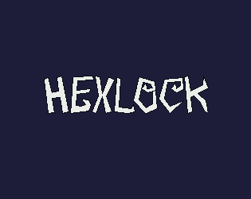
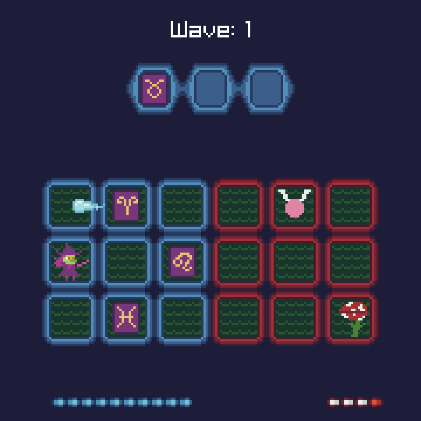
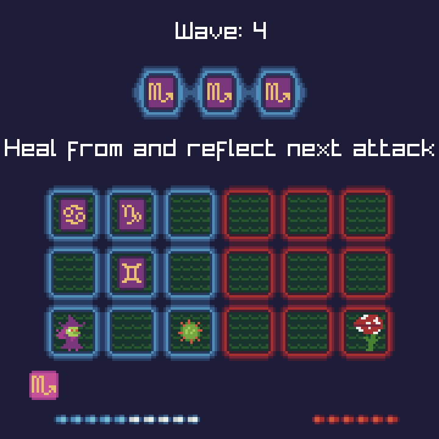
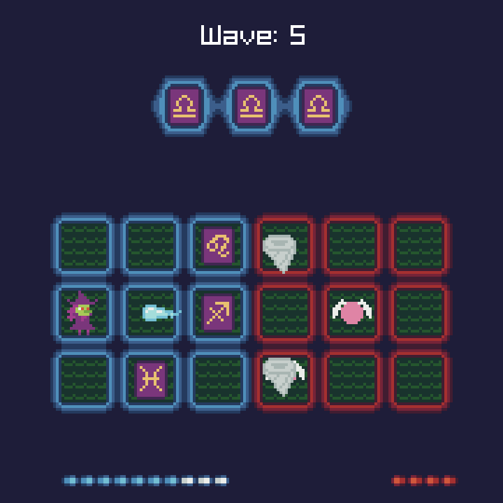

## HEXLOCK

### Description

HEXLOCK is a fast-paced and tactical action game where you stack abilities by matching symbols in twos and threes.

You play as the witch Morrigan, who seeks the arcane knowledge buried deep within the Wilted Woods.

The guardians of the forest won't go easy on you, however. To defeat them, you must find patterns in the stars and use them to hex your enemies.

### Controls

Keyboard:
 - WASD / Arrow Keys - Move
 - Space / Z - Cast missile
 - F / X - Cast hex

Gather three astral signs to add a hex to your casting pool.

### Screenshots

### Developers

 - giraffekey - Programming, Game Design, Pixel Art, Sound Design

### Credits

 - Leading the Charge by [Not Jam](https://not-jam.itch.io/)
 - Breakbeat Chips by [Not Jam](https://not-jam.itch.io/)

### Links

 - Itch.io Page: https://masterofgiraffe.itch.io/hexlock

### License

This project sources are licensed under an unmodified zlib/libpng license, which is an OSI-certified, BSD-like license that allows static linking with closed source software. Check [LICENSE](LICENSE) for further details.

*Copyright (c) 2026 giraffekey*
